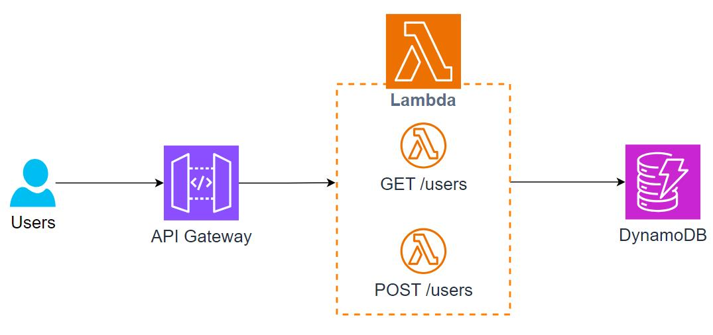

# 🚀 Serverless CRUD API using AWS

## 📌 Overview

This project is a serverless REST API that performs basic CRUD operations (Create, Read, Update, Delete) on user data.

It uses AWS services to handle requests without managing servers.

---

## 🛠️ Services Used

* AWS Lambda
* Amazon API Gateway
* Amazon DynamoDB
* Amazon CloudWatch
* AWS IAM

---

## ⚙️ Features

* Create a user (POST)
* Get user details (GET)
* Update user info (PUT)
* Delete a user (DELETE)
* API Key protection enabled

---


## 🧩 Architecture Diagram



---

## 🔗 API Endpoint

```
https://<your-api-id>.execute-api.<region>.amazonaws.com/dev/users
```

---

## 📦 Sample Requests

### ➤ Create User

```bash
curl -X POST ^
  -H "Content-Type: application/json" ^
  -H "x-api-key: YOUR_API_KEY" ^
  -d "{\"id\":\"200\",\"name\":\"Test\",\"info\":\"Demo\"}" ^
  https://<api-url>/dev/users
```

---

### ➤ Get User

```bash
curl -X GET ^
  -H "x-api-key: YOUR_API_KEY" ^
  "https://<api-url>/dev/users?id=200"
```

---

## ✅ Sample Output

```
{
  "id": "200",
  "name": "Test",
  "info": "Demo"
}
```

---

## 🔒 Security

API is protected using API Key with usage plan (rate limiting + quota).

---

## 📸 Screenshots

* API Gateway methods
* Lambda function
* DynamoDB table
* CloudWatch logs
* Successful curl output

---

## 💡 What I Learned

* Building serverless APIs using AWS
* Connecting API Gateway with Lambda
* Using DynamoDB for NoSQL storage
* Debugging with CloudWatch logs
* Implementing API key security

---

## 🚀 Future Improvements

* Add authentication (JWT / Cognito)
* Input validation
* Better error handling
* Deploy using Infrastructure as Code (Terraform / CloudFormation)

---
